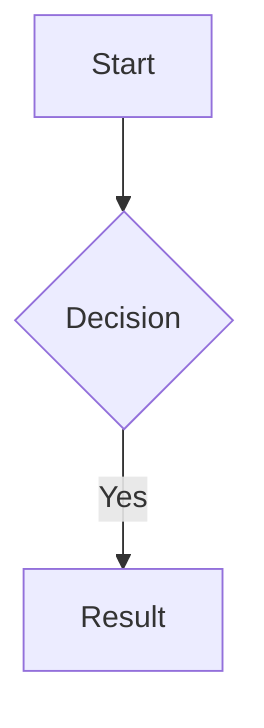

Title: Title
Author:
Required:
---

# Editing Files

## Opening a file

Double-click any file chip in the hierarchy to open it. You can also click **⋮** on any file chip in the hierarchy or the Unlinked pane and choose **View/Edit**.

## The editor

The editor opens as a panel that slides in from the right. It is split into two panes:

- **Left** — a plain text editor with markdown syntax highlighting
- **Right** — a live rendered preview that updates as you type

The preview supports GitHub Flavored Markdown (GFM) including tables, strikethrough, and task lists. Mermaid diagram code blocks are rendered as actual diagrams — see [Mermaid Diagrams](#mermaid-diagrams) below.

## View modes

Use the **edit / split / preview** buttons in the top-right of the editor toolbar to switch between:

- **edit** — text editor only
- **split** — editor and preview side by side (default)
- **preview** — rendered preview only

## Saving

Press `Ctrl+S` (or `Cmd+S` on Mac) to save. The Save button in the toolbar turns green when there are unsaved changes and goes dim when the file is clean. The file title in the hierarchy updates automatically if you change the `# H1` heading.

With vi mode enabled, `:w` saves and `:x` saves then closes the editor. See [Vi Mode](#vi-mode) below.

## Vi mode

Check the **vi** box in the editor toolbar to enable vi keybindings. Normal mode, insert mode, and visual mode all work as expected.

Vi-specific save commands:

| Command | Action |
|---------|--------|
| `:w` | Save |
| `:x` | Save and close the editor |

## Frontmatter, Stats, and Issues

Below the editor toolbar is a bar with three tabs: **Frontmatter**, **Stats**, and **Issues**. Click any tab header to expand it; clicking an open tab collapses it. Only one tab can be open at a time.

## Frontmatter

The **Frontmatter** tab shows action buttons for working with the project's frontmatter template:

- **Apply template** — adds missing template keys (with defaults) and removes extra keys from this file
- **Use as template** — sets this file's frontmatter as the project template
- **View template** — opens the template editor
- **View compliance** — opens the compliance report

Frontmatter is edited directly in the text editor. The preview pane strips it from the rendered output. See [Frontmatter](frontmatter.md) for full details.

## Stats

The **Stats** tab loads analysis for the current file on demand.

Stats shown:

- Word count, sentence count, paragraph count, average sentence length
- **Readability:** Flesch Reading Ease (with label), Flesch-Kincaid Grade, Gunning Fog, Automated Readability Index, Coleman-Liau Index

## Issues

The **Issues** tab runs a structural triage of the current file and flags potential issues in two categories.

**Warnings** (⚠) — likely problems:

- No H1 heading, or more than one H1
- Heading level jumps (e.g. H1 to H3, skipping H2)
- TODO, FIXME, TBD, or XXX markers in the text

**Info** (•) — things worth reviewing:

- Empty sections (a heading with no body text)
- Sentences over 40 words
- Paragraphs over 150 words

If no issues are found, the panel shows **No issues found**. The heading count for the file is always shown at the bottom.

See [Issues Example](scan-test.md) for a sample file that triggers every scan flag.

## Renaming from the editor

Double-click the filename in the editor toolbar to rename the file inline. The file on disk is renamed to match.

## Closing the editor

Click the **✕** button in the top right corner of the editor panel, or press `Escape`. See [Keyboard Shortcuts](keyboard-shortcuts.md) for all editor keys.

## Mermaid diagrams

The preview pane renders Mermaid diagram code blocks as actual diagrams. Use a fenced code block with `mermaid` as the language:

````

````

Supported diagram types include flowcharts, sequence diagrams, pie charts, Gantt charts, class diagrams, and more. See the [Mermaid documentation](https://mermaid.js.org/) for the full syntax reference.

If the syntax is invalid, the preview shows an error message instead of the diagram. The diagram renders live as you type — no save required.

## Project notes

The project notes file can also be opened for editing via **⋮ → Info** on the project chip. This file does not appear in the hierarchy and cannot be renamed.
