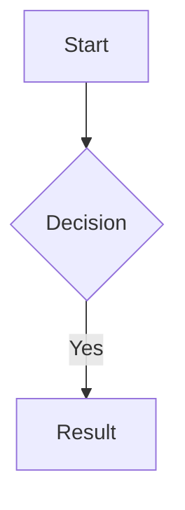

Title: Title
Author:
Required:
---

# Editing Files

## Opening a file

Double-click any file chip in the hierarchy to open it. You can also click **⋮** on any file chip in the hierarchy or the Unlinked pane and choose **View/Edit**.

## The editor

The editor opens as a panel that slides in from the right. It is split into two panes:

- **Left** — a plain text editor with markdown syntax highlighting
- **Right** — a live rendered preview that updates as you type

The preview supports GitHub Flavored Markdown (GFM) including tables, strikethrough, and task lists. Mermaid diagram code blocks are rendered as actual diagrams — see [Mermaid Diagrams](#mermaid-diagrams) below.

## View modes

Use the **edit / split / preview** buttons in the top-right of the editor toolbar to switch between:

- **edit** — text editor only
- **split** — editor and preview side by side (default)
- **preview** — rendered preview only

## Saving

Press `Ctrl+S` (or `Cmd+S` on Mac) to save. The Save button in the toolbar turns blue when there are unsaved changes and goes dim when the file is clean. The file title in the hierarchy updates automatically if you change the `# H1` heading.

With vi mode enabled, `:w` saves and `:x` saves then closes the editor. See [Vi Mode](#vi-mode) below.

## Vi mode

Check the **vi** box in the editor toolbar to enable vi keybindings. Normal mode, insert mode, and visual mode all work as expected.

Vi-specific save commands:

| Command | Action |
|---------|--------|
| `:w` | Save |
| `:x` | Save and close the editor |

## Editor tab bar

Below the editor toolbar is a bar with the following tabs: **Frontmatter**, **Template**, **Stats**, **Issues**, and **Structure**, and on the right side a **Themes** button, an **Images** button, and a **Scan Project** button. Click any tab header to expand it; clicking an open tab collapses it. Only one tab can be open at a time. The Stats, Issues, and Structure panels open as floating overlays so they don't push the editor down.

## Frontmatter

The **Frontmatter** tab shows action buttons for working with the project's frontmatter template:

- **Apply template** — adds missing template keys (with defaults) and removes extra keys from this file
- **Use as template** — sets this file's frontmatter as the project template
- **View template** — opens the template editor
- **View compliance** — opens the compliance report

Frontmatter is edited directly in the text editor. The preview pane strips it from the rendered output. See [Frontmatter](frontmatter.md) for full details.

## Template

The **Template** tab shows action buttons for working with the project's file structure template:

- **Use as template** — saves the current file as the project's file template. The template defines which section headings new files should contain.
- **Apply template** — appends any headings from the template that are missing from the current file, with empty sections for each.

To manage the file template from the project menu, click **⋮** on the project chip and choose **File Template → View template** (opens the template in the editor as a tab) or **File Template → Compliance** (scans all files and reports which are missing required headings, with an option to apply the template to individual files).

New files are pre-populated from the file template automatically when one is set. See [Building Your Hierarchy](hierarchy.md).

## Stats

The **Stats** tab loads analysis for the current file on demand.

Stats shown:

- Word count, sentence count, paragraph count, average sentence length
- **Readability:** Flesch Reading Ease (with label), Flesch-Kincaid Grade, Gunning Fog, Automated Readability Index, Coleman-Liau Index

## Issues

The **Issues** tab runs a structural triage of the current file and flags potential issues in two categories.

**Warnings** (⚠) — likely problems:

- No headings at all
- No H1 heading (other headings exist but no top-level title)
- More than one H1 heading
- Heading level jumps (e.g. H1 to H3, skipping H2)
- TODO, FIXME, TBD, or XXX markers in the text

**Info** (•) — things worth reviewing:

- Empty sections (a heading with no body text)
- Sentences over 40 words
- Paragraphs over 150 words

If no issues are found, the panel shows **No issues found**. The heading count for the file is always shown at the bottom.

See [Issues Example](scan-test.md) for a sample file that triggers every Issues flag.

## Structure

The **Structure** tab shows the heading skeleton of the current file — the outline with per-section word counts.

Each line shows the heading level (`#`, `##`, etc.), the heading title, and the word count for that section's direct body text (not including sub-sections). Sections with no body text show a dash. The footer shows total heading count, maximum nesting depth, and total word count.

## Themes

The **Themes** button opens a menu of editor color themes. Select any theme to apply it immediately. Your choice persists across sessions.

Available themes:

- **One Dark**, **Monokai**, **Andromeda**, **Gruvbox Dark**, **Xcode Dark** — dark themes
- **Xcode Light**, **Solarized Light** — light themes

## Images

The **Images** button on the right of the tab bar opens the Project images dialog, which shows all images in the project's `images/` folder (a sibling directory of `markdowns/`).

From this dialog you can:

- **Browse** — view thumbnails of all images in the project
- **Insert** — click any thumbnail to insert it at the cursor position in the editor as a markdown image link (the path is relative to the file's location in the project)
- **Add images** — click **Add images** in the dialog header to open a file picker and copy images into the project's `images/` folder
- **Open folder** — click **Open folder** to open the `images/` directory in your file manager
- **Delete** — hover over a thumbnail and click **✕** to delete an image (with confirmation)

The Images button is only visible when a file is open in the editor. To manage images without opening a file, use **⋮ → Images** on the project chip.

If you click a thumbnail while the editor is open, the image is inserted at the current cursor position and the dialog closes. If you open the dialog from the project chip menu (not the editor), clicking thumbnails does nothing — use it to browse or manage images only.

## Scan Project

The **Scan Project** button on the right of the tab bar runs Stats, Issues, and Structure analysis on every file in the current project and produces a single HTML report. The same action is available from **⋮ → Scan Project** in the project menu.

The report opens in a full-screen overlay and includes:

- A summary table with word count, readability score, and issue badges for each file
- A per-file section with the full stats grid, issues list, and structure outline

Use the **Save as HTML** button to download the report, or **Print / Save as PDF** to send it to a printer or PDF writer.

## Multi-tab editor

Each file you open adds a tab to the vertical strip along the left edge of the editor panel. Click any tab to switch to it. Tabs are color-coded alternating blue and orange.

- A small circle at the bottom of a tab indicates unsaved changes
- Click the close icon at the top of a tab to close that file without closing the panel
- When all tabs are closed, the editor panel closes
- Click the **«** button at the top of the strip to collapse the tab strip; click **»** to expand it again

Tabs and their contents persist across sessions — when you reopen PiTH, your previously open files are restored.

## Renaming from the editor

Double-click the filename in the editor toolbar to rename the file inline. The file on disk is renamed to match.

## Closing the editor

Click the **✕** button in the top right corner of the editor panel to close the entire panel. To close a single file without closing the panel, click the close icon at the top of its tab in the vertical strip. See [Keyboard Shortcuts](keyboard-shortcuts.md) for all editor keys.

## Mermaid diagrams

The preview pane renders Mermaid diagram code blocks as actual diagrams. Use a fenced code block with `mermaid` as the language:

````

````

Supported diagram types include flowcharts, sequence diagrams, pie charts, Gantt charts, class diagrams, and more. See the [Mermaid documentation](https://mermaid.js.org/) for the full syntax reference.

If the syntax is invalid, the preview shows an error message instead of the diagram. The diagram renders live as you type — no save required.

## Project notes

The project notes file can also be opened for editing via **⋮ → File → Project info** on the project chip. This file does not appear in the hierarchy and cannot be renamed.
