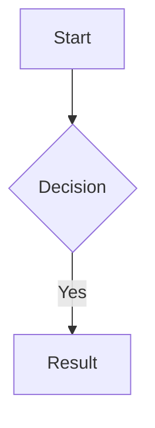

# Editing Files

## Opening a file

Double-click any file chip in the hierarchy to open it. You can also click **⋮** on any file chip in the hierarchy or the Unlinked pane and choose **View/Edit**.

## The editor

The editor opens as a panel that slides in from the right. It is split into two panes:

- **Left** — a plain text editor with markdown syntax highlighting
- **Right** — a live rendered preview that updates as you type

The preview supports GitHub Flavored Markdown (GFM) including tables, strikethrough, and task lists. Mermaid diagram code blocks are rendered as actual diagrams — see [Mermaid Diagrams](#mermaid-diagrams) below.

## Saving

Press `Ctrl+S` (or `Cmd+S` on Mac) to save. The file title in the hierarchy updates automatically if you change the `# H1` heading.

Unsaved changes are indicated by a dot in the editor toolbar.

## Renaming from the editor

Double-click the filename in the editor toolbar to rename the file inline. The file on disk is renamed to match.

## Closing the editor

Click the **✕** button in the top right corner of the editor panel, or press `Escape`. See [Keyboard Shortcuts](keyboard-shortcuts.md) for all editor keys.

## Mermaid diagrams

The preview pane renders Mermaid diagram code blocks as actual diagrams. Use a fenced code block with `mermaid` as the language:

````

````

Supported diagram types include flowcharts, sequence diagrams, pie charts, Gantt charts, class diagrams, and more. See the [Mermaid documentation](https://mermaid.js.org/) for the full syntax reference.

If the syntax is invalid, the preview shows an error message instead of the diagram. The diagram renders live as you type — no save required.

## Project notes

The project notes file can also be opened for editing via **⋮ → Info** on the project chip. This file does not appear in the hierarchy and cannot be renamed.
